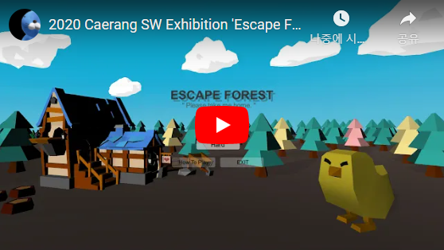

# 2020 Caerang SW Exhibition &#60;Escape Forest&#62;

안녕하세요! 저희는 서주현, 남서영 입니다 :)

저희는 이번 2020년도 SW전시회 작품으로 
UNITY엔진을 사용하여 "ESCAPE FOREST" 게임을 제작하였습니다.

삐약이가 무사히 집으로 돌아갈 수 있도록 미로를 탈출하는 게임으로 
세가지 난이도로 플레이 하실 수 있습니다.

많은 시간과 노력으로 만들어진 작품 즐겁게 감상하시고
좋은 평가 부탁드립니다. 감사합니다 :)

<ol>
  <li>팀원
    <ul>
      <li>빅데이터전공 20185135 서주현
      <li>콘텐츠IT 20195153 남서영</ul> 
  <li>역할분담
    <ul>
      <li>남서영 - 맵 디자인 작업, 시작 및 종료화면 구현
      <li>서주현 - 맵 내부 메뉴 구현 및 충돌처리 구현  
    </ul>
  <li>어떤언어를 사용했는가
    <ul><li>유니티, C#</ul> 
  <li>게임 설명
    <ul>UNITY엔진과 C#언어를 사용하여 제작된 "ESCAPE FOREST"게임은
 삐약이가 무사히 집으로 돌아갈 수 있도록 미로를 탈출시키는 게임입니다.
 또한 'easy', 'normal', 'hard' 세 가지 난이도로 나뉘어져 원하시는 모드로
      플레이 할 수 있습니다.</ul> 

  <li>소감
    <ul>UNITY를 사용하여 게임을 만들면서 다시 UNITY에 대하여 복습할 수 있어 좋았고,
 나름 만족스러운 작품을 제작한 것 같습니다. 다만 아쉬운 점이 있다면 추가로 타이머, 사운드 등
      추가적인 요소들을 시간 상 추가하지 못하여 아쉬움이 남습니다.</ul> 
    <li>시연영상
</ol>

